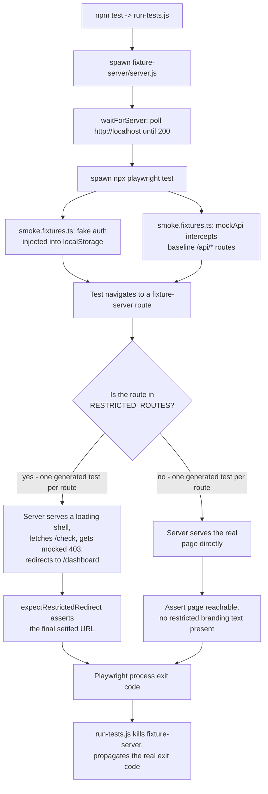

# E2E Test Suite Patterns

[](https://github.com/daud-khan-qa/e2e-test-suite-patterns/actions/workflows/ci.yml)
[](https://playwright.dev)

[](#license)

**All rights reserved.** This repository is shared publicly for portfolio and demonstration purposes only. No license is granted to copy, modify, or redistribute this code without my permission.

Sanitized reference implementation of the patterns behind 438 Playwright E2E test cases I personally authored and merged into a production SaaS codebase across 6 product modules.

## Test coverage by module

| Module | Test cases |
| --- | --- |
| Site Explorer | 194 |
| Keyword tools | 68 |
| Route-access & branding gating | 62 |
| Backlinks | 38 |
| Onboarding | 29 |
| Billing | 47 |
| **Total** | **438** |

Counted directly from the codebase with `npx playwright test --list`, which correctly resolves data-driven tests (a single loop over a route array can generate dozens of real test instances that a plain source-code search would undercount).

## Why these patterns, specifically

### 1. Data-driven test generation over copy-paste
Route-access rules, permission matrices, and per-item CRUD checks are naturally repetitive - the wrong move is copy-pasting a near-identical test per route. `tests/route-access-gating.spec.ts` shows the pattern instead: one test body, driven by a data array, with each generated test still getting its own readable name in the runner output. That matters for triage - a failure needs to say *which* route broke, not "test 14 of 40 failed."

### 2. Hermetic tests, not live-credential tests
Every test here runs against mocked auth state and intercepted API routes (`fixtures/smoke.fixtures.ts`) - no real account, no real backend, no secrets to manage. That's what makes a suite safe to run in CI on every PR rather than only manually against a shared account. The billing and route-gating suites in the real codebase both follow this pattern.

### 3. `test.fixme` with a tracked ticket, never a silent skip
When a test can't pass because of a genuine product gap (not a test bug), it's marked `fixme` with a comment pointing at a real tracked ticket ID - see `tests/onboarding-wizard.spec.ts`. A silent `test.skip` with no explanation is how coverage quietly rots; a fixme with a ticket ID is a paper trail that survives the person who wrote it leaving the team.

### 4. The pre-merge checklist (`docs/pre-merge-checklist.md`)
Every one of the 438 tests went through the same checklist before merge: pipeline verified green job-by-job, no arbitrary `waitForTimeout` calls, a co-located unit test for any non-test source file touched, whitespace-clean diffs, and no `test.only` left behind.

## How a test run actually executes

This repo is unusual among sanitized reference suites: it doesn't just validate its own config, it runs against a real, self-contained local app and produces genuine pass/fail results. This diagram is traced directly against `run-tests.js`, `fixture-server/server.js`, and `fixtures/smoke.fixtures.ts` - not an idealized version.



The two branches under `H` are what `test_route-access-gating.spec.ts`'s two `for` loops actually generate - `RESTRICTED_ROUTES` and `ALLOWED_ROUTES` each produce one real, independently-named test per entry, which is the data-driven pattern from point 1 above shown as an actual runtime path, not just described.

## Running it yourself

```bash
npm install
npx playwright install chromium
npm test
```

## Structure

```
fixtures/
  smoke.fixtures.ts        Hermetic base fixture: mocked auth + API interception
fixture-server/
  server.js                Minimal local app the tests run against
tests/
  route-access-gating.spec.ts   Data-driven test generation over a route matrix
  onboarding-wizard.spec.ts     Multi-step flow + a real test.fixme-with-ticket example
docs/
  pre-merge-checklist.md   The checklist every merged test satisfied
```

## Sample output

```
$ npm test

Running 11 tests using 6 workers

  -   1 [chromium] › onboarding-wizard.spec.ts › browser back-button during step 2 preserves step 1 form data (DEMO-142, open)
  ok  2 [chromium] › route-access-gating.spec.ts › /admin-panel redirects for a standard account @smoke (612ms)
  ok  3 [chromium] › route-access-gating.spec.ts › /billing-internal redirects for a standard account @smoke (623ms)
  ok  4 [chromium] › route-access-gating.spec.ts › /team-management redirects for a standard account @smoke (706ms)
  ok  5 [chromium] › onboarding-wizard.spec.ts › step 1: creating a workspace advances to step 2 @smoke (808ms)
  ok  6 [chromium] › onboarding-wizard.spec.ts › final step: "Get Started" completes onboarding @smoke (754ms)
  ok  7 [chromium] › onboarding-wizard.spec.ts › step 2: skipping team invites still advances @smoke (791ms)
  ok  8 [chromium] › route-access-gating.spec.ts › /dashboard is reachable for a standard account @smoke (174ms)
  ok  9 [chromium] › route-access-gating.spec.ts › /reports is reachable for a standard account @smoke (171ms)
  ok 10 [chromium] › route-access-gating.spec.ts › /settings/profile is reachable for a standard account @smoke (178ms)
  ok 11 [chromium] › route-access-gating.spec.ts › branding never leaks a restricted-tier product name @smoke (161ms)

  1 skipped
  10 passed (2.8s)
```

The 1 skipped test is the `test.fixme` referenced above - a known, ticketed gap, not a hidden failure.

## Relationship to my other repos

- [`agentic-safety-patterns`](https://github.com/daud-khan-qa/agentic-safety-patterns) - the AI-agent safety-engineering side of the work (precision gating, fail-closed invariants)
- [`playwright-billing-qa-suite`](https://github.com/daud-khan-qa/playwright-billing-qa-suite) - the billing-specific patterns (dynamic button labels, Stripe soft-checks)
- [`ai-agentic-qa-framework`](https://github.com/daud-khan-qa/ai-agentic-qa-framework) - the AI-agent-driven QA side of the work (browser automation, hydration reliability)
- This repo is the disciplined, peer-reviewed, hand-authored E2E work the others build on top of.

---
Sanitized reference implementation - module names, routes, and business-specific copy are generalized placeholders. Test counts and the review discipline described reflect real production work.
